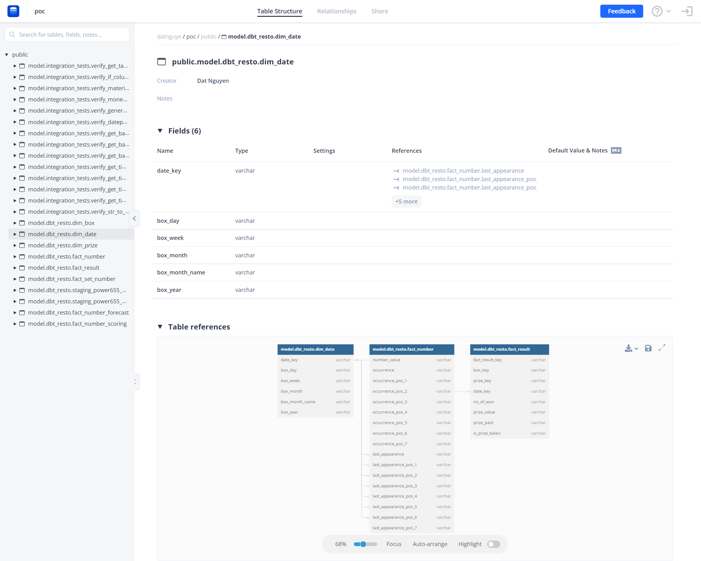

# dbterd (BETA)
CLI to generate DBML file from dbt manifest.json


```
pip install dbterd==0.1.4b0
```

Verify installed version:
```
dbterd --version
```


```bash
dbterd -h
Usage: dbterd [OPTIONS] COMMAND [ARGS]...

  Tools for producing diagram-as-code

Options:
  --version   Show the version and exit.
  -h, --help  Show this message and exit.

Commands:
  debug  Inspect the hidden magics
  run    Run the convert

  Specify one of these sub-commands and you can find more help from there.
```

## Quick examine command
```bash
# note that no relationship test = no erd relationship
dbterd run -mp "./samples/v7-adfacebook" -o "./target"
dbterd run -mp "./samples/v7-fivetranlog" -o "./target"
dbterd run -mp "./samples/v4-dbtresto" -o "./target" 
```

## Quick DEMO
#### 1. Produce your manifest json

In your dbt project (I am using dbt-resto/[integration_tests](https://github.com/datnguye/dbt-resto) for demo purpose), try to build the docs:
```bash
dbt docs generate
```
    
#### 2. Generate DBML
Copy `manifest.json` into a specific folder, and run 
```
dbterd run -mp "/path/to/manifest" -o "/path/to/output"
# dbterd run -mp "./target" -o "./target"
```

File `./target/output.dbml` will be generated as the result

#### 3. Build database docs site
Assuming you're already familiar with [dbdocs](https://dbdocs.io/docs#installation)
```
dbdocs build "/path/to/output/output.dbml"
# dbdocs build "./target/output.dbml"
```

Your terminal should provide the info as below:
```bash
√ Parsing file content
? Project name:  poc
‼ Password is not set for 'poc'
√ Done. Visit: https://dbdocs.io/datnguye/poc
```

The site will be looks like:

